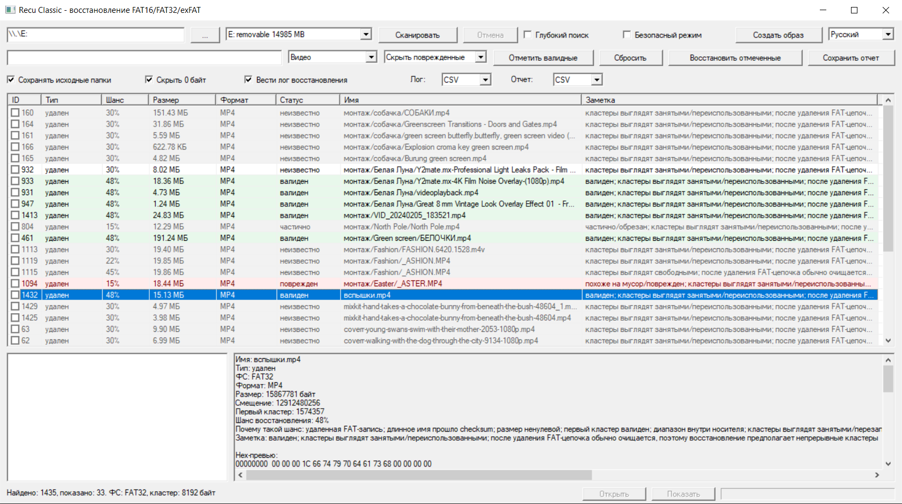

# Recu Classic

Recu Classic — портативная Win32-программа для восстановления удаленных файлов с USB-флешек, SD-карт и образов дисков `.img/.dd`.

Поддерживаются FAT16, FAT32 и exFAT. Есть быстрое сканирование по удаленным записям файловой системы и глубокое сканирование по сигнатурам файлов.

## Скриншот



## Возможности

- Восстановление удаленных файлов с FAT16/FAT32/exFAT.
- Работа с физическими носителями и образами `.img/.dd`.
- Создание образа носителя перед сканированием.
- Быстрое сканирование по удаленным записям файловой системы.
- Глубокое сканирование по сигнатурам файлов.
- Восстановление с сохранением исходных папок.
- Предпросмотр JPEG/PNG.
- Чтение EXIF-метаданных фотографий.
- Проверка найденных файлов.
- Оценка шанса восстановления с объяснением причин.
- Поиск дублей и пересечений.
- Защита от восстановления на тот же диск.
- Отчеты и лог восстановления в CSV/JSON/LOG.
- Русский и английский интерфейс.
- Портативная версия без установки.

## Скачать

Готовая сборка находится в Releases:

`Recu Classic v1.0.0-beta.1 portable win64`

## Важно

Не восстанавливайте файлы на тот же носитель, с которого идет сканирование.

Если данные важные, сначала создайте образ носителя и сканируйте уже образ.

Используйте программу только для восстановления своих данных или данных, на восстановление которых у вас есть разрешение.

## Сборка

```sh
make all
make test
make portable
```

## Ограничения

- NTFS пока не поддерживается.
- Глубокое сканирование может находить ложные совпадения.
- Если данные уже перезаписаны, восстановленный файл может быть поврежден.
- Для чтения физических дисков Windows может потребовать запуск от имени администратора.
